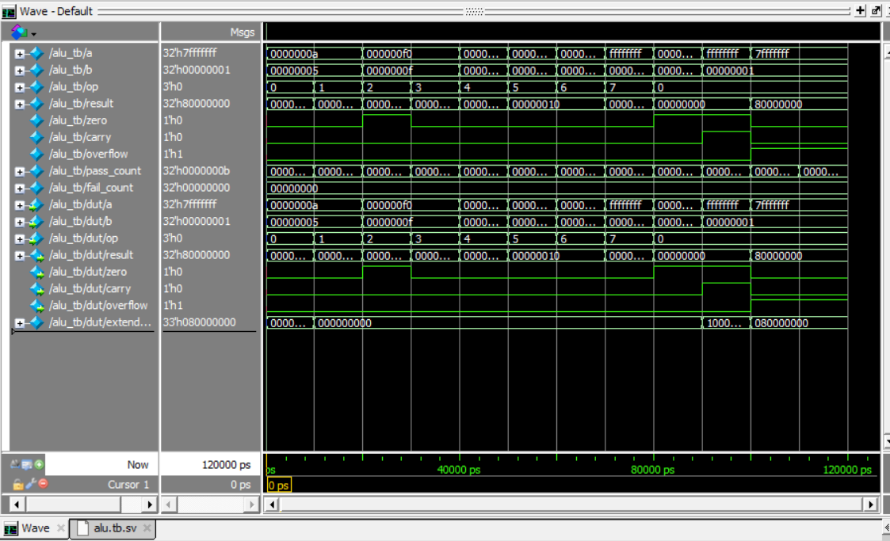

# ALU Verification

## Verification status

The portable smoke flow is defined for Icarus Verilog. In this repair environment Icarus was not installed, so the updated RTL smoke was not executed here. The constrained-random class and covergroup are intended for a SystemVerilog simulator with class/coverage support; the Icarus path uses portable pseudo-random stimulus and does not collect covergroup coverage.

## Repository

This repository contains the RTL/testbench/automation sources for the project. Review fixes are summarized in the package-level `CHANGES.md`.

# 32-bit ALU Verification

This is my first SystemVerilog verification project.

I designed and verified a 32-bit ALU using Questa Altera Starter Edition.

The ALU supports:

- Addition
- Subtraction
- AND
- OR
- XOR
- Shift left
- Shift right
- Signed comparison

I created a self-checking testbench and used assertions to check the output. I also tested carry, zero and overflow conditions.

The simulation completed successfully, and I saved the waveform as proof.

# Project Files

- `rtl/alu.sv` - ALU design
- `tb/alu.tb.sv` - Testbench and assertions
- `alu_waveform.png` - Simulation waveform

# Waveform

# Tools Used

- SystemVerilog
- Questa Altera Starter Edition
- Visual Studio Code
- Git and GitHub

# What I Learned

I learned how to write an ALU, create test cases, use assertions, check simulation results and view waveforms.
